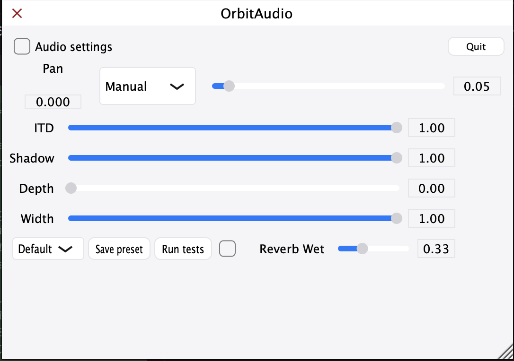

# OrbitAudio

A macOS menu bar app for real-time 3D/8D-style binaural spatialization.

Real-time binaural-style stereo spatializer: pan with interaural time difference (ITD) and head-shadow filtering for 3D/8D-style listening.

## What it does

OrbitAudio takes stereo input and applies:

- **Pan** — Left/right balance (-1 = full left, +1 = full right).
- **ITD (interaural time difference)** — A short delay on the “far” ear so the sound feels like it’s coming from a direction.
- **Head shadow** — A low-pass filter on the far ear to mimic your head blocking high frequencies.
- **Orbit mode** — Manual, Orbit (3D), or Figure-8 (8D). The latter two drive pan from an LFO for swirling spatial motion.
- **Speed (Hz)** — LFO rate for Orbit/Figure-8 modes (0.02–0.5 Hz).
- **Depth** — HF rolloff to simulate distance (0 = close, 1 = far).
- **Width** — Stereo field scale (0 = narrow, 1 = full).
- **Reverb** — Optional stereo reverb with adjustable wet amount.

Together this gives a binaural-style sense of direction with 3D/8D-style orbit modes. Best experienced with headphones.

## Screenshots

## Menu bar app

OrbitAudio runs as a **menu bar (status bar) app**—no dock icon. On launch you'll see the OrbitAudio icon in the top menu bar. Click it to open the Control Center-style panel with all spatialization controls. Click again or use the close button to hide the panel. Right-click the icon for "Open OrbitAudio" or "Quit". Audio keeps running when the panel is hidden. Use **Audio settings** to expand device selection (input/output, buffer size, sample rate).

## Pipeline (e.g. BlackHole)

Typical use: route stereo from your DAW or system (e.g. via **BlackHole 16ch**) into OrbitAudio’s input, then set OrbitAudio’s output to your headphones or monitor. The app uses a single stereo in → stereo out path; the rest of the 16ch pipeline can feed other tools.

## Low latency

OrbitAudio is optimized for minimal latency:

- On first run (no saved device state), the app requests the smallest available buffer size (128 samples or lower when supported).
- The device selector shows buffer size and sample rate; choose **128 samples** (or lower) for lowest latency.
- Audio device selection is persisted to `~/Library/Application Support/OrbitAudio/audioDeviceState.xml` and restored on launch.
- Denormal protection and in-place processing keep the DSP path lean.

## Tech

- **Tech stack:** C++, JUCE, macOS.
- **JUCE** (C++), macOS GUI app.
- **Build**: Open `NewProject/Builds/MacOSX/OrbitAudio.xcodeproj` in Xcode and build. The built app is at `Builds/MacOSX/build/Debug/OrbitAudio.app` (or Release). Copy to Applications or run from the build folder.
- **DSP**: The spatializer lives in `Source/Spatializer.cpp` (delay + LPF + LFO + depth/width); the UI in `Source/MainComponent.cpp` passes parameters.

## For your website

Short blurb you can copy to a dedicated project page: OrbitAudio is a menu bar app that applies binaural-style spatialization (ITD, head shadow, orbit modes) to stereo input in real time. It’s built for low latency and works well in a DAW or system-audio pipeline (e.g. with BlackHole). Best with headphones.

**Highlights:** Pan and ITD for direction; head-shadow filtering; Manual / Orbit (3D) / Figure-8 (8D) modes; adjustable depth and width; optional reverb; presets; persisted audio device and low-latency defaults.

## License

See [LICENSE](LICENSE) in this repository.
